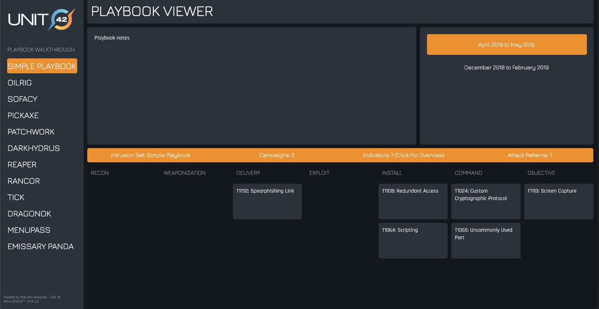

# Playbook Structure

A Playbook consists of:
* One Intrusion Set
* One or more Campaigns (Plays)
  * Each Campaign is associated with Indicators and/or Attack Patterns.
* Zero or more Indicators
  * Each Indicator is required to be related to at least one Attack Pattern. 
* One or more Attack Patterns
  * Attack Patterns are not required to be related to indicators.

The simplest possible Playbook can hierarchically look like:

```
Playbook
    Intrusion Set
    Campaign 1
        Attack Pattern 1
```

or:

```
Playbook
    Intrusion Set
    Campaign 1
        Attack Pattern 1
            Indicator 1
``` 

A slightly more complicated Playbook can hierarchically look like:

```
Playbook
    Intrusion Set
    Campaign 1
        Attack Pattern 1
            Indicator 1
        Attack Pattern 2
```

The JSON file for a Playbook with this exact structure can be seen [here](./very-simple-playbook.json)

And in the Playbook Viewer [here](https://pan-unit42.github.io/playbook_viewer/?pb=very-simple-playbook)

A more realistic Playbook can hierarchically look like:

```
Playbook
    Intrusion Set
    Campaign 1
        Attack Pattern 1
            Indicator 1
        Attack Pattern 2
            Indicator 2
            Indicator 3
        Attack Pattern 3
            Indicator 4
    Campaign 2
        Attack Pattern 1
            Indicator 1
            Indicator 2
        Attack Pattern 2
            Indicator 3
        Attack Pattern 3
            Indicator 4
        Attack Pattern 4
        Attack Pattern 5
        Attack Pattern 6
            Indicator 5
    ...
```

In the Playbook Viewer:



The JSON file can be seen [here](./simple-playbook.json)

And in the Playbook Viewer [here](https://pan-unit42.github.io/playbook_viewer/?pb=simple-playbook)

# Playbook JSON

#### The objects in a Playbook are stored in STIX 2.0 JSON.

At the top level is a [Bundle object][1], containing an [Intrusion Set][2],
[Reports][3], [Campaigns][4], [Indicators][5], [Attack Patterns][6], 
[Identities][8], [Malwares][9] and [Relationship][7] objects.

The Playbook is represented by a Report object, containing a description and a reference list.

The reference list contains an id for the Intrusion Set object, as well as an id for each additional Report object
(one for each campaign).

Each Campaign is represented by a Report object and a Campaign object. 

The Report object contains a reference list with the ids of the objects associated with the Campaign, 
while the Campaign object contains a description and the dates during which it was observed.

The details of the Campaign are provided by Indicator objects and Attack Patterns.

The Campaign may also use an Identity object to provide details on the target.

Each Indicator object contains an [indicator pattern][5].

Each Indicator object may also be related to Malware object(s) which provide details on the family of malware.

The Attack Patterns are from the MITRE [ATT&CK][10] Framework, with the addition of a Lockheed Martin Kill Chain phase.

The structure of a Playbook is provided by Relationship objects, which are directional (source_ref and target_ref).

#### Within a Playbook, the Relationships are:

* Indicator --> Campaign
  * The Indicator 'indicates' the Campaign

* Indicator --> Attack Pattern
  * The Indicator 'Uses' the Attack Pattern
  
* Indicator --> Malware
  * The Indicator 'indicates' the Malware

* Campaign --> Attack Pattern
  * The Campaign 'uses' the Attack Pattern

* Campaign --> Identity
  * The Campaign 'targets' the Identity 

* Campaign --> Intrusion Set
  * The Campaign is 'attributed-to' the Intrusion Set

* Report --> Intrusion Set
  * Only the top level report is linked to the Intrusion Set
  * The Report is 'attributed-to' the Intrusion Set

If a relationship has an indicator as one of the two objects, the indicator is always the source object. 

This allows the Playbook to handle the same indicator being related to multiple Attack Patterns, 
or having the same Indicator in more than one Campaign. In addition, it allows for optional descriptions to be 
contextual without having to duplicate the indicator pattern.

[1]: http://docs.oasis-open.org/cti/stix/v2.0/cs01/part1-stix-core/stix-v2.0-cs01-part1-stix-core.html#_Toc496709292
[2]: http://docs.oasis-open.org/cti/stix/v2.0/cs01/part2-stix-objects/stix-v2.0-cs01-part2-stix-objects.html#_Toc496714316
[3]: http://docs.oasis-open.org/cti/stix/v2.0/cs01/part2-stix-objects/stix-v2.0-cs01-part2-stix-objects.html#_Toc496714325
[4]: http://docs.oasis-open.org/cti/stix/v2.0/cs01/part2-stix-objects/stix-v2.0-cs01-part2-stix-objects.html#_Toc496714304
[5]: http://docs.oasis-open.org/cti/stix/v2.0/cs01/part2-stix-objects/stix-v2.0-cs01-part2-stix-objects.html#_Toc496714313
[6]: http://docs.oasis-open.org/cti/stix/v2.0/cs01/part2-stix-objects/stix-v2.0-cs01-part2-stix-objects.html#_Toc496714301
[7]: http://docs.oasis-open.org/cti/stix/v2.0/cs01/part2-stix-objects/stix-v2.0-cs01-part2-stix-objects.html#_Toc496714338
[8]: http://docs.oasis-open.org/cti/stix/v2.0/cs01/part2-stix-objects/stix-v2.0-cs01-part2-stix-objects.html#_Toc496714310
[9]: http://docs.oasis-open.org/cti/stix/v2.0/cs01/part2-stix-objects/stix-v2.0-cs01-part2-stix-objects.html#_Toc496714319
[10]: https://attack.mitre.org/